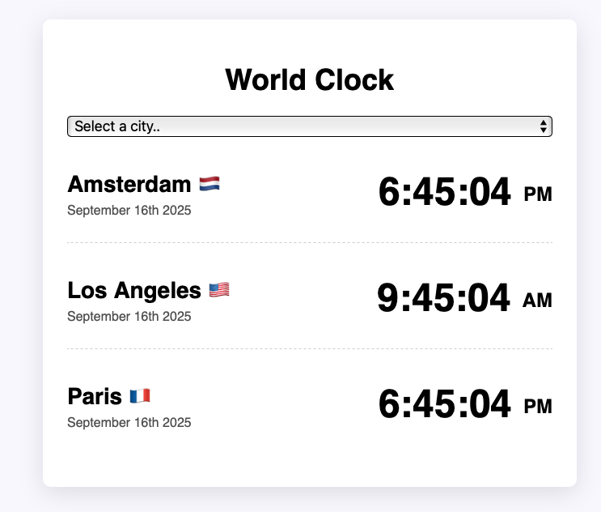

# World Clock
Displays current time for multiple cities around the world.

## Highlights
- Role: Implemented UI logic for live time updates.
- Tech: JavaScript, HTML, CSS, Date API.
- Outcome: Add/remove cities and see real-time updates in the UI.

## Run
Open `index.html` locally or check a preview in `ephemeral-churros-450286.netlify.app`.
